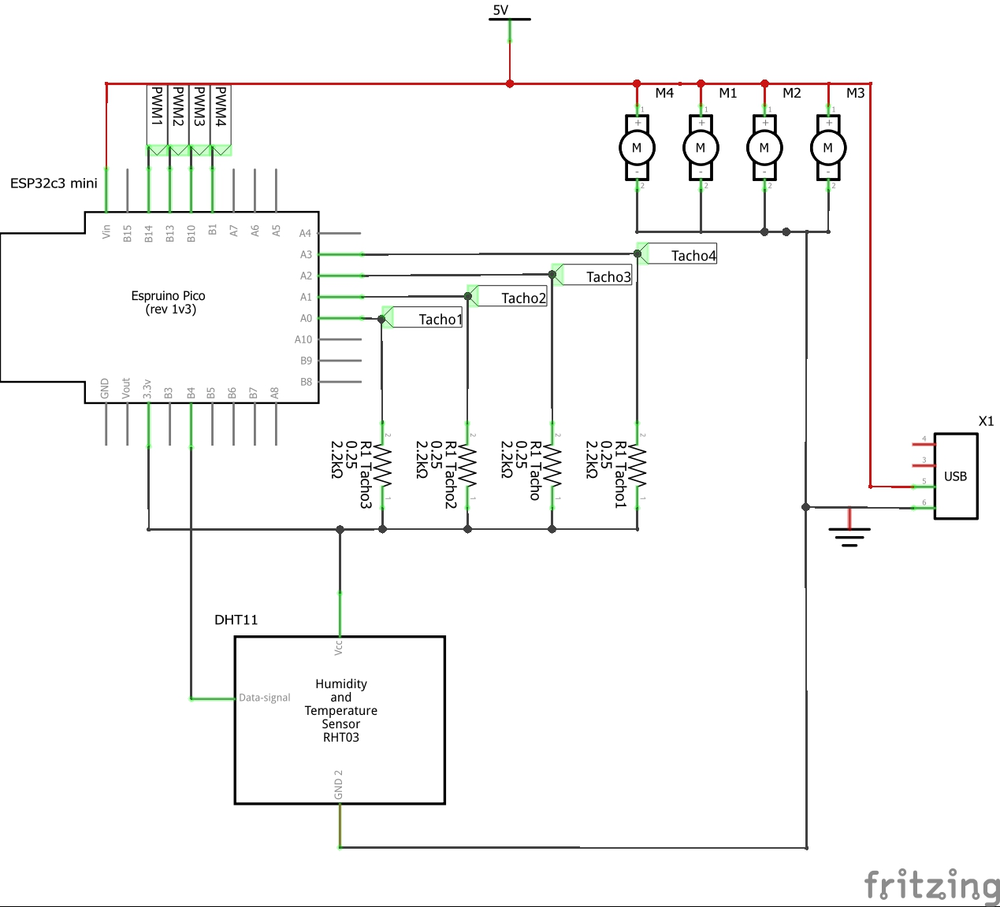

# ESPhome silent fan control for heaters (ESP32 c3)

Features:

* Automatic fan control depending on heater temperature
* Connected to HomeAssistant with MQTT
* All features ESPHome brings

Planned features:

* Power efficient - deep sleep
* Control override

---

Software requirements:

* Modern Python version
* ESPhome

Required hardware (Adapt to your needs):

* 4x 5V PWM fans with RPM sensing
* DHT11 temp sensor
* 5V power supply

## Circuit diagram

Ignore the ESP on the diagram, as it does not match the ESP32c3.
Use the pins specified in the esp32c3_bedroom_pwm.yaml.template.



## Setup development

Depending on your OS you may want to create a venv first.

```bash
pip install -r requirements.txt 
```

## Build and flash

### secrets.txt

Create a file named secrets.txt on the same root directory with these contents:

```text
WIFI_SSID=...
WIFI_PSK=...
FALLBACK_AP_SSID=...
FALLBACK_AP_PSK=...
API_KEY=...
```

### Flash

Now run `flash_bedroom.sh` to flash the ESP32 with this configuration. 

## Connection to home assistant

Follow this wizard: https://my.home-assistant.io/redirect/integration/?domain=esphome